# Simple Product Store

A modern e-commerce platform built with Next.js 16, Supabase, TypeScript, and TailwindCSS.

## Prerequisites

- Node.js v20.19.6
- npm v10.8.2
- npx v10.8.2

## Quick Start

### 1. Supabase Setup

1. **Create a Supabase Project** at [supabase.com](https://supabase.com)

2. **Get Your Credentials**
   - Go to Project Settings > API
   - Copy the `Project URL` and `anon` key (publishable key)

3. **Run Database Migrations**
   ```bash
   # Install Supabase CLI if not already installed
   npm install -g supabase
   
   # Link to your Supabase project
   supabase link --project-ref your-project-ref
   
   # Push migrations to your database
   supabase db push
   ```
   > The migrations in `supabase/migrations/` will create all required tables, RLS policies, and storage buckets.

### 2. Configure Environment Variables

```bash
cp env.example .env.local
```

Edit `.env.local`:
```
NEXT_PUBLIC_SUPABASE_URL=your-project-url-here
NEXT_PUBLIC_SUPABASE_PUBLISHABLE_DEFAULT_KEY=your-anon-key-here
```

### 3. Install & Run

```bash
npm install
npm run dev
```

Open [http://localhost:3000](http://localhost:3000) in your browser.

## Tech Stack

- **Frontend**: Next.js 16 (App Router)
- **Language**: TypeScript
- **Styling**: TailwindCSS 4
- **Backend**: Supabase (PostgreSQL + Auth + Storage)
- **Icons**: Heroicons

## Features

### 🔐 Authentication & Authorization
- Email/password registration with confirmation email
- Secure login system with session management
- Protected routes with middleware
- User-specific dashboards

### 📦 Product Management
- Full CRUD operations (Create, Read, Update, Delete)
- Multi-image upload with interactive carousel
- Category organization (Electronics, Books, Clothing)
- Tag system for better organization
- Product like/favorite feature
- Rich text descriptions

### 🔗 Public Sharing
- Unique shareable URLs for each product (`/p/[shareId]`)
- Public product views accessible without authentication

### 🛒 Shopping Cart & Checkout
- Add to cart functionality
- Cart persistence across sessions
- Quantity management
- Mock checkout flow with order confirmation

### 🔍 Filter & Browse
- Category-based filtering
- Product browsing and discovery

## Application Walkthrough

Experience the complete user journey from sign-up to order completion:

<p>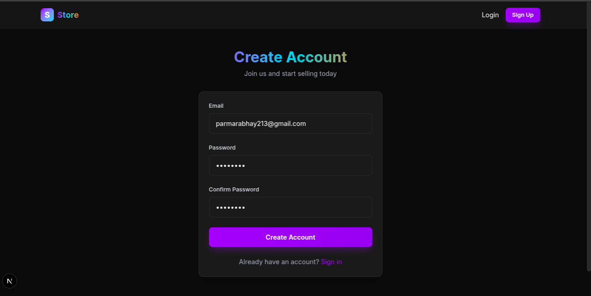
User registration page wNEXT_PUBLIC_SUPABASE_URL=your-project-url-here
NEXT_PUBLIC_SUPABASE_PUBLISHABLE_DEFAULT_KEY=your-anon-key-hereith email and password fields</p>
<br>

<p>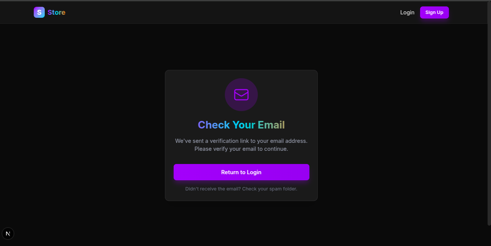
Email verification prompt displayed after registration</p>
<br>
   
<p>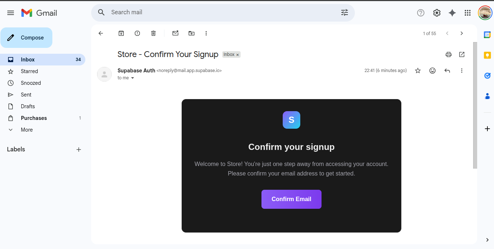
Confirmation email received in inbox</p>
<br>
   
<p>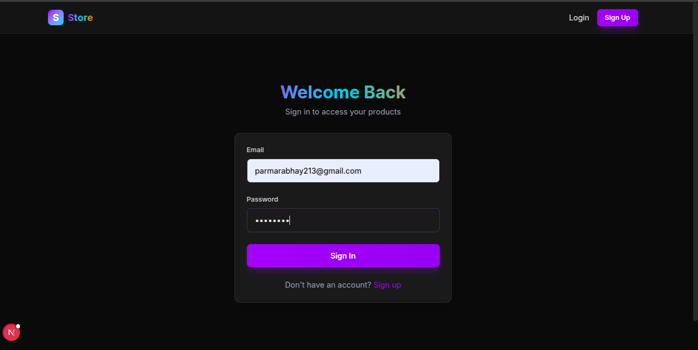
User login interface with credential inputs</p>
<br>
   
<p>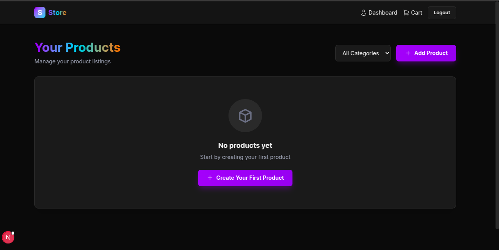
Empty dashboard prompting user to add first product</p>
<br>
   
<p>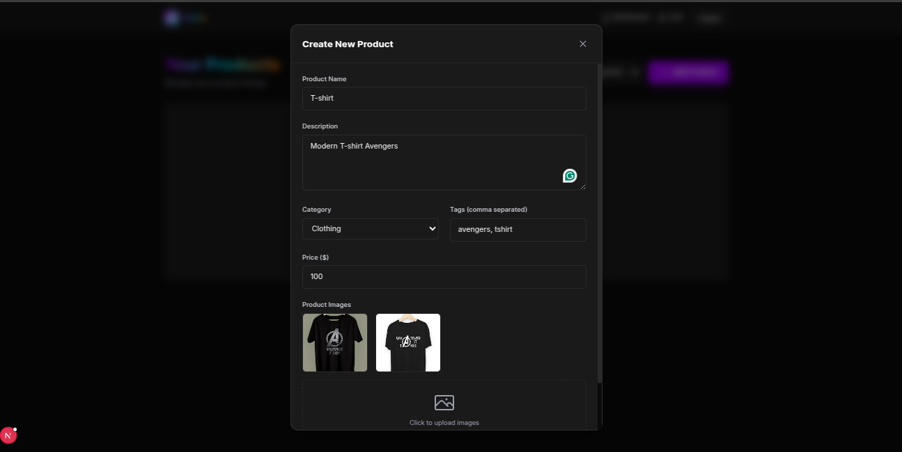
Product creation form with image upload and details</p>
<br>
   
<p>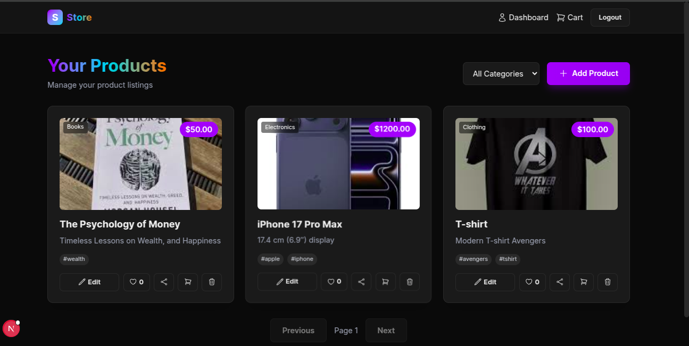
Dashboard showing multiple products in grid layout</p>
<br>
   
<p>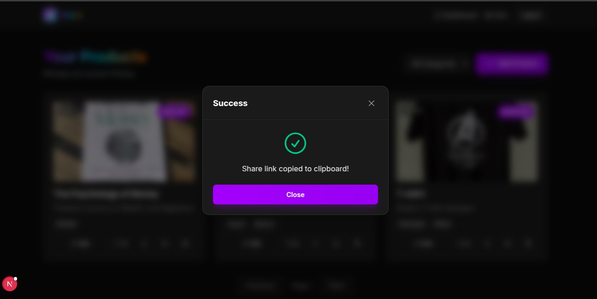
Copying shareable public link for a product</p>
<br>
   
<p>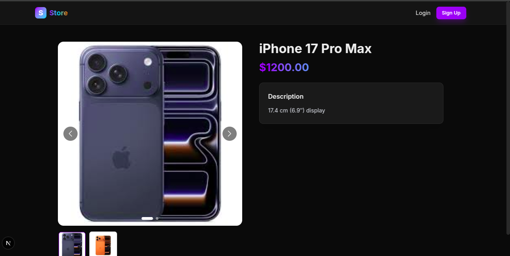
Public product view accessible via shareable link</p>
<br>
   
<p>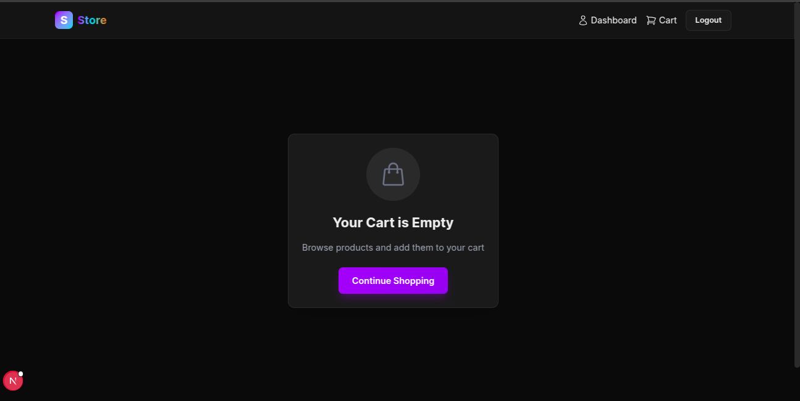
Empty cart with message to start shopping</p>
<br>
   
<p>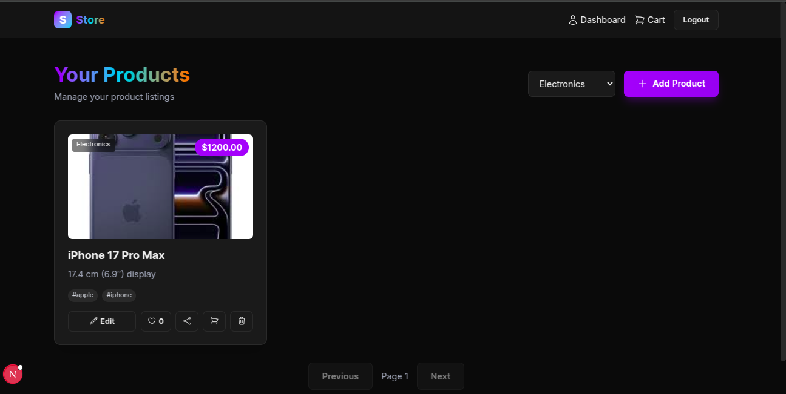
Product list filtered to show Electronics category</p>
<br>
   
<p>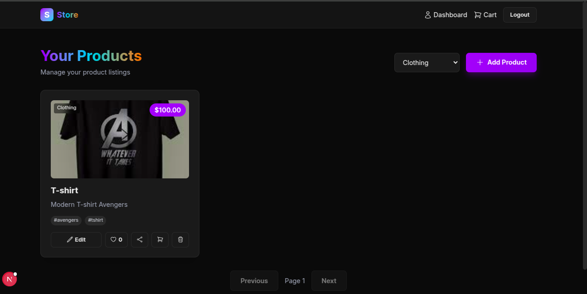
Product list filtered to show Clothing category</p>
<br>
   
<p>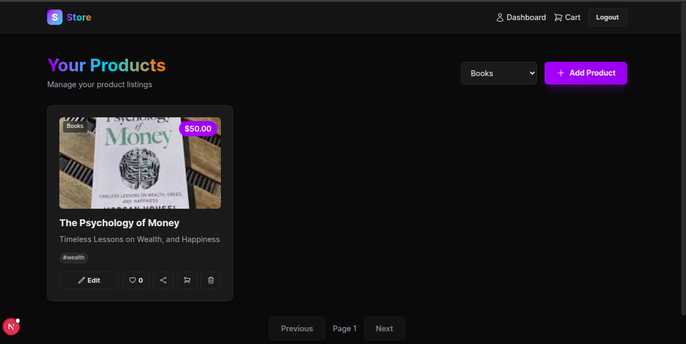
Product list filtered to show Books category</p>
<br>
   
<p>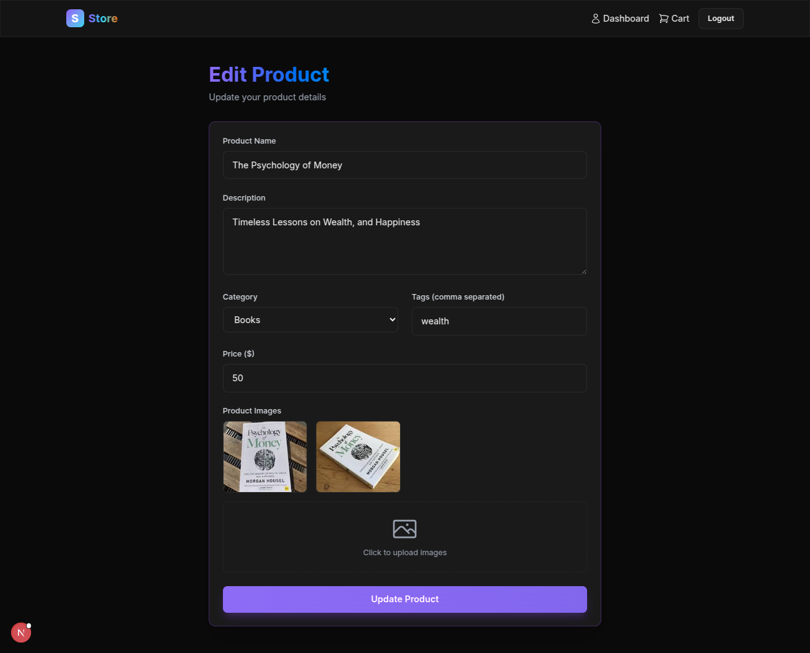
Product edit form with pre-filled data</p>
<br>
   
<p>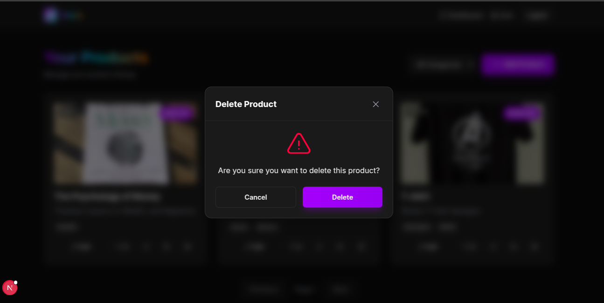
Confirmation dialog before deleting a product</p>
<br>
   
<p>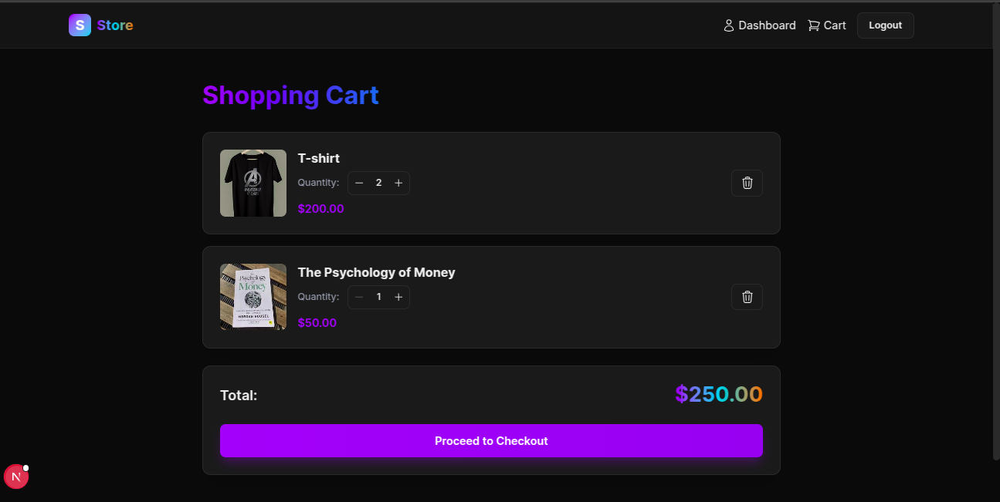
Shopping cart containing selected products</p>
<br>
   
<p>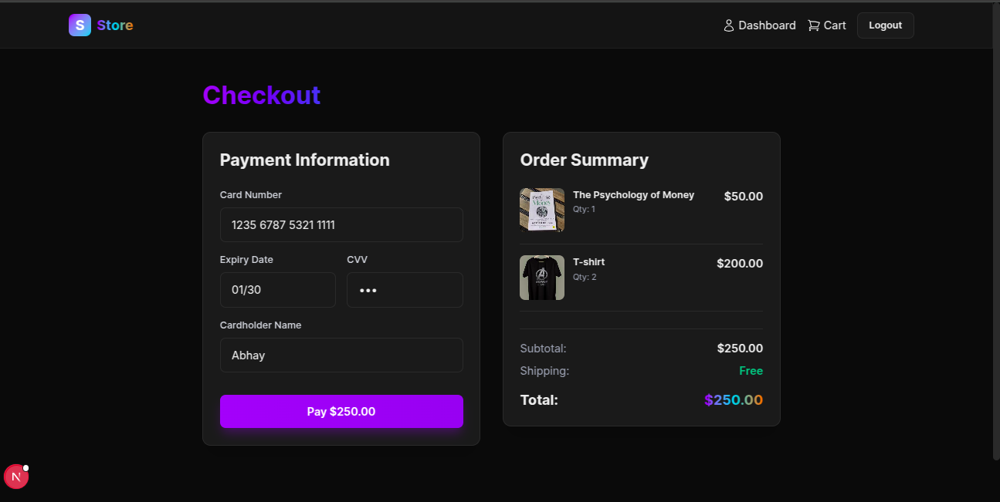
Checkout page displaying order summary</p>
<br>
   
<p>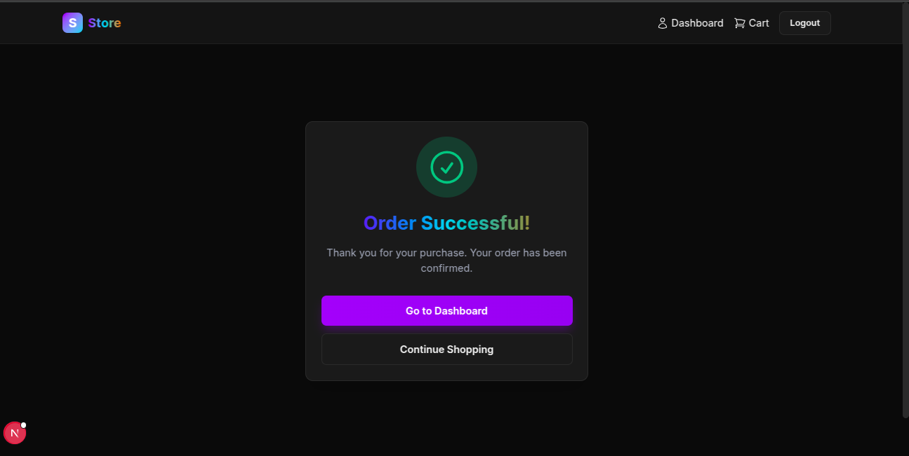
Success message confirming order completion</p>

## Project Structure

```
ng-assignment/
├── app/                        # Next.js App Router pages
│   ├── dashboard/              # Product management dashboard
│   ├── products/               # Product browsing page
│   ├── p/[shareId]/            # Public product view (shareable links)
│   ├── cart/                   # Shopping cart page
│   ├── checkout/               # Checkout flow
│   ├── login/                  # User login page
│   ├── register/               # User registration page
│   ├── verify-email/           # Email verification page
│   ├── globals.css             # Global styles
│   ├── layout.tsx              # Root layout component
│   ├── page.tsx                # Home page
│   ├── error.tsx               # Error boundary
│   ├── not-found.tsx           # 404 page
│   └── global-error.tsx        # Global error handler
│
├── components/                 # Reusable UI components
│   ├── Navbar.tsx              # Navigation bar with auth state
│   ├── HeroSection.tsx         # Landing page hero section
│   ├── ProductForm.tsx         # Add/Edit product form
│   ├── ImageCarousel.tsx       # Product image carousel
│   ├── AddToCartButton.tsx     # Add to cart functionality
│   ├── Modal.tsx               # Reusable modal component
│   └── QueryProvider.tsx       # React Query provider wrapper
│
├── contexts/                   # React Context providers
│   └── AuthContext.tsx         # Authentication context & provider
│
├── hooks/                      # Custom React hooks
│   ├── useProducts.ts          # Product CRUD operations hook
│   └── useCart.ts              # Shopping cart operations hook
│
├── lib/                        # Utility functions
│   └── env.ts                  # Environment variable validation
│
├── supabase/                   # Supabase configuration & services
│   ├── services/               # Database service layer
│   │   ├── supabase.ts         # Supabase client initialization
│   │   ├── products.ts         # Product database operations
│   │   └── cart.ts             # Cart database operations
│   ├── migrations/             # Database migrations
│   │   └── 76767676767_initial_schema.sql  # Initial DB schema
│   ├── types.ts                # TypeScript types for Supabase
│   └── config.toml             # Supabase local config
│
├── public/                     # Static assets
│   └── screenshots/            # Application screenshots
│
├── middleware.ts               # Next.js middleware (route protection)
├── next.config.js              # Next.js configuration
├── tailwind.config.ts          # TailwindCSS configuration
├── tsconfig.json               # TypeScript configuration
└── package.json                # Project dependencies
```
